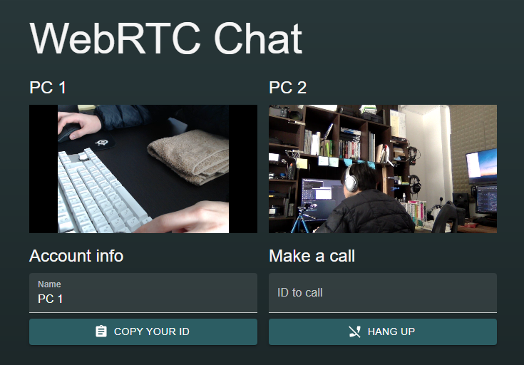

# WebRTC peer-to-peer demo

WebRTC + P2P で映像を送り合うデモです。

### 各コンポーネントの説明

#### /server

シグナリングサーバです。  
Webhook を使ってクライアント間の SDP の授受を仲介します。  
Express で実装。

#### /client

クライアントで動作させる Web アプリです。
React で実装。

#### /simple-peer-demo

simple-peer の動作確認に使いました。アプリには関係ありません。

### Screenshot

### 課題

- 発信した側に相手の名前が伝達されない
- NAT 越えができない (STUN+TURN 未実装)

今のところ直すつもりはありません。  
SFU 型の方がニーズがありそうなので、P2P はこの程度にしておきます。  
気が向いた方がいたら、勝手に直しちゃってください。
